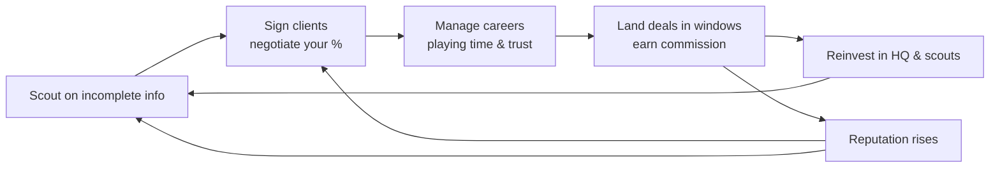

# Football Agent Game — v1 Python Build Plan

**Status:** ✅ Implemented and playable — see [how-to-run.md](how-to-run.md)
**Date agreed:** 2026-08-15
**Source scope document:** `~/knowledge-base/scribe-2026-08-15-Football Agent Game Core Systems.md`

> This document records the design and the reasoning behind it. Section 9 at the
> end records what building it actually taught us — including three places where
> the design was wrong and had to change.

---

## 1. Purpose of this build

This is a **simple Python build whose job is to nail down the core game mechanics**. It is
not a product. The iPhone version is a later, deliberate rewrite.

That framing drives every decision below:

- The **rules and the tuned numbers** are the asset. They must be readable, testable, and
  transcribable into Swift.
- The **CLI is disposable**. It exists so a human can look at the state and play a season.
- Anything that makes the mechanics harder to *judge* is cut, even if it would make the
  game richer.

The question this build must answer: **is the core loop good?**

---

## 2. The core loop



Each week you press **Continue**. Costs are paid, interest arrives, scouts report, rivals
move, trust shifts, results come in — surfaced as an inbox of events.

---

## 3. Design decisions

### 3.1 Economy

| Element | Decision |
| --- | --- |
| Weekly retainer | Small — a % of each client's wages. Covers running costs, makes upgrades meaningful. |
| Commission | Lump sum on transfers and contract renewals. **The main earner.** |
| Your commission % | **Negotiated**, not fixed. Higher reputation → clients concede more. |

Rationale: pure retainer income makes the game "accumulate a big roster" and turns
transfers into decoration. Commission-dominant income makes every window matter and gives
scouting a genuine payoff.

### 3.2 Negotiation — the highest-risk mechanic

**One resolver, two uses:**

1. **Signing negotiation** (agent ↔ player) — agree your commission %.
2. **Deal negotiation** (agent ↔ club) — wage, contract length, signing fee.

**Model: bounded haggle.**

- Up to ~3 rounds of offer / counter-offer.
- Hidden acceptance threshold, shifted in your favour by reputation.
- Qualitative feedback hints between rounds ("they scoffed", "they're wavering").
- **Walk-away risk** if you push too hard — this is what stops "always offer the max"
  being a solved strategy.

Rejected alternatives: single-shot (no skill expression, reputation doesn't *feel* like
anything); full minigame with personalities and bluffing (a whole game on its own).

### 3.3 World simulation — "needs-profile" depth

Clubs are **rating + budget + positional needs**. No squads exist in v1.

- League tables generated from strength-weighted result rolls.
- Interest in your clients arises from a club's *stated need* and *wage headroom* — so an
  offer is legible ("they want a left-back and have headroom") rather than arbitrary.

A facade (clubs as bare ratings) would make offers feel random, which would poison our
ability to judge the negotiation mechanics — the entire point of this build. Full squad
simulation is a Football Manager project and is deferred to a later feature build; clubs
sit behind a boundary so squads can slot in without a rewrite.

**Scale:** one country, two tiers, ~40 clubs, five regions. A second country should be a
JSON file, not a code change.

### 3.4 Time

- **One week per Continue.**
- **Season calendar** with summer and winter transfer windows.
- Deals can only be struck inside windows. Outside them you scout, sign, renew and build
  reputation.

Windows are the best pressure device an agent game has — they give the year a shape and
stop every week feeling identical.

### 3.5 Scouting — uncertainty is the mechanic

Scouts are assigned to regions, with an optional brief (position, max age).

**Reports are ranges, not numbers.** "Ability 70–85, potential unclear."

The range narrows based on:

- Scout quality
- Agency reputation *(bigger agency → better at scouting)*
- Number of scouts assigned to that region
- How long the player has been watched

Signing is therefore a **bet on incomplete information**, and being wrong costs you.
Region star ratings describe the *talent pool*, not the quality of who you get. HQ and
scout upgrades sell **precision**, which is a far better thing to sell than raw numbers.

### 3.6 Clients

**Player model:** ability (1–100) + hidden potential (a range, revealed slowly) +
position + age + **one personality trait** driving what he wants from a move (ambition vs
money vs loyalty).

Full attribute sets are invisible in an agent game — you never pick a team. Anything less
than the above and every client is interchangeable.

**Playing time** is derived from ability vs club strength — no squads needed. It drives:

- Development (ability drifting toward potential)
- Trust
- Outside interest

This is what makes the greedy transfer *punishable*: park a 65-ability client at an
85-strength club for the wages and he rots, stops developing, and turns on you. Without
it, "move him to the richest club" is always correct and half the game's decisions vanish.

**Trust** rises with good moves and better contracts; falls when he stagnates, when you
fail to land a move he wanted, or when you chase commission against his interests. If it
bottoms out he leaves. **Tenure and agency size make him stickier** — the long game is
rewarded.

**Secondary states in v1:** injuries, transfer-listing. *(Loans deferred.)*

- Injuries: a long lay-off kills development and can waste a window. The main way a season
  goes wrong through no fault of your own.
- Transfer-listed: the club *needs* him gone, which flips the negotiation — now you're the
  one under pressure.

### 3.7 Contracts

Both are modelled:

- **Player-club contracts** — wage, length, expiry. Drives renewals, free agency, and the
  "18 months left, sell now or lose him for nothing" squeeze.
- **Agent-client contracts** — fixed term, must be renewed. **Trust gates whether he
  re-signs with you**, so expiry is a real moment of jeopardy rather than a second timer.

### 3.8 Rivals

Lightweight and abstract: a handful of named agencies with a **reputation score and
nothing else** under the hood.

- Each week, an unsigned player you've scouted may be snapped up — weighted by his quality
  and visibility.
- Unhappy clients may be poached by a higher-reputation agency.

This puts a clock on your decisions (without it, uncertainty doesn't matter because
waiting is free) at a fraction of the cost of simulating real AI opponents.

### 3.9 Reputation

**A single global number in v1**, stored behind an accessor so it can later split into
club-reputation and player-reputation without a refactor.

It gates: your commission ceiling, whether clubs take your call, whether players will sign
with you, and client retention.

Splitting it is the top post-v1 item — ruthless dealing making clubs love you while
players distrust you is thematically strong, but you can't tune two curves before you've
tuned one.

### 3.10 Failure state

Running costs (HQ, scouts) vs lumpy, window-dependent commission income.

1. Cash-negative → **warning**
2. Sustained → **forced downsizing**: scouts let go, HQ downgraded, reputation hit
3. Sustained insolvency after that → **game over**

A hard game-over at zero would be unfair given income arrives in lumps. A downsizing
spiral is more forgiving *and* more interesting — clawing back is a story. This is what
gives the Headquarters screen its bite: over-expanding before a window is a real mistake.

### 3.11 Content

**Fictional, generated, loaded from editable JSON.**

- App Store safe — no licensing landmine to defuse at launch.
- Seeded worlds are *reproducible*, which is what makes evidence-based tuning possible.
- Clubs, leagues and regions hand-tunable in JSON; players generated from region-
  appropriate name pools at world creation.

### 3.12 Starting position

A nobody: low reputation, modest cash, one-room office, **1 scout, 5-client cap**, one
unremarkable second-tier client.

Big clubs won't take your calls, so your first real win must come from a scouting bet —
which is exactly the mechanic that most needs feeling out.

**Target arc: ~10 seasons from nobody to elite.** This doubles as a yardstick for the
tuning harness: if a bot gets there in three, the curve is wrong.

---

## 4. Screens in v1

| Screen | In v1 | Why |
| --- | --- | --- |
| Inbox / Continue | ✅ | The event feed. It *is* the game. |
| Clients | ✅ | Trust, contracts, offers. |
| Scouting | ✅ | Regions, scouts, ranged reports. |
| Headquarters | ✅ | Scout capacity, client cap, scouting precision. Main money sink. |
| Finances | ✅ | You need to see the bankruptcy spiral coming. One summary page. |
| Clubs | ✅ | Can't judge an offer without knowing if they're 3rd or 18th. Cheap. |
| Upgrades (properties/vehicles) | ❌ v1.1 | Pure cost-for-bonus sink, no new decision. A second sink before the first is tuned makes the economy unreadable. |

---

## 5. Technical design

### 5.1 Principles

- **Zero runtime dependencies in the engine.** Fewer library idioms baked into the rules =
  easier to reimplement in Swift.
- **`rich` for the CLI, `pytest` for tests.** The throwaway layer gets to be pleasant.
- **Systems are `(world, rng) → events`.** Fixed execution order in the tick. No system
  reaches into another; they communicate via world state and the event log.
- **The typed event log is the engine's real interface.** This is the single most portable
  decision in the plan — it makes the iPhone rewrite a UI job, not archaeology.
- **All tunables in `balance.json`.** Commission curves, reputation gains, trust decay,
  scouting variance, wage tables. Tuning = editing a file and re-running the harness. The
  iPhone port inherits tuned numbers as *data*.

### 5.2 Events

The tick emits structured, typed events — `InterestReceived(client, club, terms)`,
`ScoutReport(player, range)`, `ClientLeft(client, reason)`, `CommissionEarned(...)`.

- CLI renders them as text.
- iPhone would render the identical events as an inbox with badges.
- **Tests assert on them directly**, and the harness counts them across 100 seasons.

### 5.3 Randomness and saves

**Derived per-system RNG streams**, seeded from `(world_seed, week, system_name)`. Not a
single global generator whose state is serialised.

Why this matters: reloading a save must not change the future, and — critically for tuning
— changing the negotiation code must not reshuffle every downstream scouting result. Without
derived streams you can never tell what a change actually did.

**Saves:** plain JSON, single autosave after each tick, **schema version field from day
one**.

### 5.4 Layout

```
football_agent/
  engine/            # pure rules, zero deps
    models.py        # dataclasses
    world.py         # world generation
    events.py        # typed event definitions
    rng.py           # derived per-system streams
    tick.py          # orchestrates the weekly tick
    persistence.py   # JSON save/load, schema versioning
    systems/
      scouting.py
      negotiation.py # the shared bounded-haggle resolver
      transfers.py
      development.py # playing time, ability drift, injuries
      finance.py     # retainers, costs, downsizing spiral
      rivals.py
      league.py      # result rolls, tables
  data/              # clubs, regions, name pools, balance.json
  cli/               # rich-based screens
  harness/           # bot policies, batch runner, CSV output
tests/
```

### 5.5 Validation and tuning

**A headless tuning harness alongside the CLI**, plus pytest unit tests on the resolvers.

Scripted bot policies — *cautious* (never overspends), *greedy* (always takes the biggest
commission), *reckless* (over-expands) — run across ~100 seeded seasons, emitting CSV of
cash, client count, deals closed, reputation, bankruptcies, seasons-to-elite.

This is how "is the commission curve right?" becomes answerable. **If the greedy bot wins
every time, the trust system isn't biting hard enough.** It doubles as a regression test:
change a rule, re-run, see what moved.

Hand-playing gives ~5 biased seasons per change. That is not enough to tune on.

---

## 6. Build order — risk first

Negotiation carries reputation, commission, trust and the greedy-deal tension. If the
bounded haggle turns out flat or trivially solvable, that must surface on day two, not day
twenty.

| Milestone | Contents |
| --- | --- |
| **M1 — Skeleton** | Models, world generation, RNG streams, JSON save/load, tick loop, finances. Runnable: advance weeks, watch money move. |
| **M2 — Negotiation** | The bounded-haggle resolver, standalone and fully tested, with a script to exercise it in isolation. |
| **M3 — Clients** | Development, derived playing time, trust, injuries, agent-client contracts. |
| **M4 — Scouting** | Regions, scouts, ranged reports with narrowing, signing negotiation, rivals. |
| **M5 — Deals** | Transfer windows, club interest from needs-profiles, deal negotiation, commission, transfer-listing. |
| **M6 — Economy & UI** | HQ upgrades, bankruptcy spiral, league tables, full six-screen CLI. |
| **M7 — Tuning** | Harness, bot policies, 100-season runs, balance pass. |

Every milestone ends **runnable**, even if thin.

---

## 7. Explicitly deferred

Not in v1 — recorded so they don't creep back in:

| Deferred | When |
| --- | --- |
| Upgrades screen (properties, vehicles) | v1.1 — once the money curve is tuned |
| Loan deals and loan-listing | v1.1 — needs a parallel deal type with different terms |
| Multiple countries | After the single-country economy feels right (JSON, not code) |
| Continental competition (Champions League) | Prestige decoration until the core loop works |
| Full squads, AI-to-AI transfers, competition for minutes | Later feature build — clubs are behind a boundary for this |
| Split reputation (club-rep vs player-rep) | Top of the post-v1 list; cheap because rep sits behind an accessor |
| iPhone / Swift port | After mechanics are proven and tuned. Deliberate rewrite, carrying `balance.json` and the event vocabulary across. |

---

## 8. Open risks

1. **The bounded haggle may be solvable.** Mitigated by tackling it in M2 and by the greedy
   bot in the harness. If greedy always wins, walk-away risk and trust penalties need to bite
   harder.
2. **Commission income is lumpy and window-bound**, which could make the mid-game a cash
   desert. The downsizing spiral softens this; the harness will show whether it's still too
   punishing.
3. **Two retention timers** (trust and agent-client contract expiry) could feel redundant.
   Trust gating renewal success is what keeps them from measuring the same thing — worth a
   look during M3.
4. **Scouting uncertainty may frustrate rather than intrigue** if ranges are too wide early.
   Range width is in `balance.json` precisely so this is a dial, not a rewrite.

---

## 9. What building it actually taught us

The build is done. Five things the plan got wrong, and what they were changed to.

### 9.1 The signing threshold was computable — so the haggle wasn't a haggle

As designed, a player's acceptance point was a pure function of your reputation
and his personality. Personality is *visible in the scouting report*. So the
"hidden" threshold could be worked out with arithmetic, and the bounded haggle
would have degenerated into a lookup table within an hour of play.

**Fix:** every player and club now carries a hidden `negotiation_bias`, derived
from the world seed so it's stable for that individual all game. The player is
shown a **guide band** ("agents of your standing usually command 7.0%–10.4%")
and has to pick a number inside it. Reputation still moves the band; the
individual decides where in it they sit.

This is the single most important change made during the build. Without it the
central mechanic was decoration.

### 9.2 A walk-away could be re-rolled, so the risk was fictional

Negotiations are transient objects. Nothing stopped you opening a new one against
the same club the moment the last one collapsed — which made "push too hard and
they walk" completely free.

**Fix:** an approach hosts exactly one negotiation, and the attempt is consumed
the moment you *name a number* (not when you open the talks, so backing out
before proposing is still free). A signing that walks puts the player on a
ten-week cooldown. Opening a negotiation is now itself a decision.

There's a test for this — `test_one_negotiation_per_approach`.

### 9.3 A client could be sold every few weeks

Nothing modelled a settling period, so clubs circled a client continuously and
the bots transferred the same player fifteen times in two seasons. The transfer
market was a conveyor belt.

**Fix:** `transfers.min_weeks_at_club_for_interest` (44 weeks). Transfer-listing
and actively seeking a move bypass it, because in both cases somebody *wants* him
gone.

### 9.4 The greedy-deal penalty could never fire

The penalty for cashing in on a client was keyed to an absolute commission
percentage (>12%). But a low-reputation agent physically cannot reach 12% — the
band tops out around 10% early on. So the penalty that enforces the game's
central tension never triggered for the exact players who most need to feel it.

**Fix:** the penalty is keyed to the *guide band for your reputation* — taking
near the maximum your standing can squeeze, on a move that damages him. Greed now
costs the same thing at every level.

### 9.5 Hoarding cash beat reinvesting

The first stable harness run had the cautious policy (which hoards) beating the
balanced one (which reinvests) on every axis, with the balanced agent going
bankrupt 60% of the time. Expansion was strictly a mistake.

The obvious hypothesis — upgrades are too expensive — was **tested and proved
wrong**: making them cheaper made every policy *worse*, because cheap upgrades
tempt agents into overheads they still can't service. The real problem was that
income per client was too thin to service any overhead at all.

**Fix:** retainer 5% → 7.5% of wages, and commission weights raised. Reinvesting
now beats hoarding, which is the intended shape.

This one is worth dwelling on: the harness didn't just find the problem, it
*falsified the first fix*. That is the entire argument for building it.

### 9.6 Where the balance currently sits

30 seeded worlds, 10 seasons each:

| Policy | Median commission | Median reputation | Clients | Bankrupt | Elite by |
| --- | --- | --- | --- | --- | --- |
| balanced | £1.00M | 54 | 6 | 10% | season 8 |
| cautious | £622k | 51 | 4 | 5% | season 8 |
| greedy | £591k | 21 | 5 | 50% | never |
| reckless | £137k | 0 | 6 | 95% | never |
| passive | £0 | 0 | 0 | 100% | never |

The shape is right:

* **Measured play wins.** The balanced reference tops the table.
* **Greed is tempting but wrong** — it earns competitively while halving your
  reputation and giving you a 50% chance of going under.
* **Over-expansion and passivity are both fatal**, for different reasons.
* **Elite standing takes 8–10 seasons**, matching the intended arc.

### 9.7 Still open

* **Elite is reached by only ~10% of bot runs.** A skilled human should do better
  than a scripted bot, so this may be right — but it needs a human playtest to
  confirm rather than another harness run.
* **The inbox floods with rival signings.** Informative, but it drowns the events
  that need a decision. Worth a filter or a digest line.
* **Injuries are currently the least interesting system** — they subtract, but
  they never create a decision. Rehabilitation choices would fix that.
* **Two retention timers** (trust and agent-contract expiry) still overlap more
  than the design assumed. Trust gating renewal keeps them distinct, but it wants
  a human playtest.
