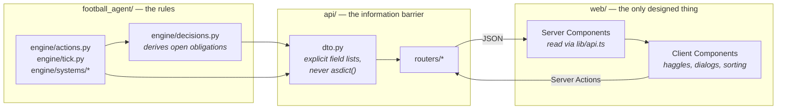

# Documentation

Durable notes on how this project is built and why. `docs/` holds the original
design and build plans; this folder records what was actually shipped.

| Document | What it covers |
| --- | --- |
| [features/agency-expansion.md](features/agency-expansion.md) | Agency growth, careers, market/loans, persistence, UI and balance observations |
| [ui/design-system.md](ui/design-system.md) | Colour, type, surfaces, motion, and the primitives every screen is built from |
| [ui/app-shell.md](ui/app-shell.md) | The three-zone console layout, navigation, and responsive behaviour |
| [decisions-model.md](decisions-model.md) | Why "needs a decision" is derived from world state instead of the event feed |
| [changelog.md](changelog.md) | What changed in the UI overhaul, and the bugs it uncovered |

## The one-paragraph version

The Python engine in `football_agent/` is the asset and holds every rule. A thin
FastAPI service wraps it and speaks JSON. The Next.js app in `web/` holds **no
game rules** — every number it shows comes from the API, preformatted, and
hidden state (`Player.ability`, `Player.potential`, `Negotiation.threshold`, the
world seed) never crosses the wire. See
[docs/ui_build_plan/01-architecture.md](../docs/ui_build_plan/01-architecture.md)
for the reasoning.

