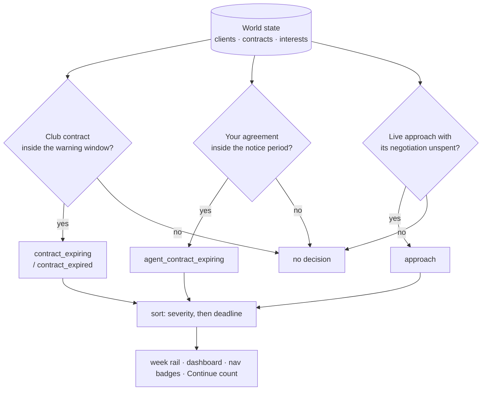

# The decisions model

`football_agent/engine/decisions.py`, surfaced at `GET /api/game/decisions` and
inside `GET /api/game/inbox`.

## The problem

The inbox answers *"what happened?"*. The list beside Continue has to answer a
different and much more useful question: *"what is still waiting on me?"*

Those two were conflated. The UI's "needs a decision" list was built by filtering
the last four weeks of the event feed for `Severity.ACTION` — a **window over
history**, not a set of open conditions. Three things went wrong as a result:

1. **Acting on something never cleared it.** Renewing a contract does not retract
   the event announcing that it was expiring, so the prompt sat there for another
   four weeks telling you to do a thing you had already done.
2. **Announcements sat alongside obligations.** "The summer window is open" and
   "a scout is unassigned" are worth knowing, but neither is a decision addressed
   to you about a specific client — and mixing them in drowned the ones that
   were.
3. **Nothing could be ranked**, because an event has no notion of how close its
   deadline is.

The net effect was a list long enough and wrong often enough that the correct
response was to ignore it.

## The fix

Derive the list from the world as it stands. Every entry is a real open
condition with a resolution, so it disappears the instant you resolve it — no
dismissal step, no expiry window, and no way for the list to disagree with the
world.

Nothing here is a new rule. The contract warning window comes from
`balance.transfers.contract_expiry_warning_weeks` and the agent-contract notice
period from `systems.contracts.AGENT_CONTRACT_NOTICE_WEEKS` — the same
thresholds the weekly tick already warns on, so the list and the feed agree.

## What counts as a decision

| Kind | Condition | Severity |
| --- | --- | --- |
| `contract_expired` | Client has no club, or his contract has run out | critical |
| `contract_expiring` | Inside the warning window | action, or warning if further out |
| `agent_contract_expiring` | Your agreement is inside its notice period | action, critical under 4 weeks |
| `approach` | A live interest whose one negotiation is unspent | action, or warning if blocked |

**Mid-contract is not a decision.** This is the single biggest source of the
noise the old list produced: a client with two years left is not asking anything
of you, and saying so every week is what teaches you to stop reading.

Demoted to the feed or a quiet badge: the window opening, a new report arriving,
an idle scout. They are worth knowing; none is an obligation addressed to you
about a client.

## Approaches are shown even when they are worse

An approach carries a wage *ceiling* — what the club could stretch to, not an
offer on the table — and every one is labelled against what the client earns
now: `▲ £1.9k on now` in the good colour, `▼ £1.1k below now` dimmed. Those that
beat his current terms sort higher and carry the accent.

Ones that pay *less* are still shown, deliberately. Commission on transfers is
the main income, approaches expire after a few weeks, and there is no way to get
one back. A lower wage at a club where he would actually play develops him,
keeps his trust up, and still pays a fee. Hiding those would let the UI make an
irreversible decision on the player's behalf, silently.

The card carries the one-negotiation warning plainly, because with a mouse it is
far too easy to click something irreversible — in the terminal you had to read
the line before typing.

## Consistency guarantee

`pending_actions` in `GET /api/game` is now `sum(d.actionable for d in
open_decisions(...))`. The badge on Continue, the nav counts and the rail all
read the same derived list. Previously the badge counted recent ACTION events
and the list showed something else; the two disagreed constantly.

`tests/test_decisions.py` guards the central property — a decision exists
exactly as long as its condition does — including the specific regression that
renewing a deal clears its prompt.
