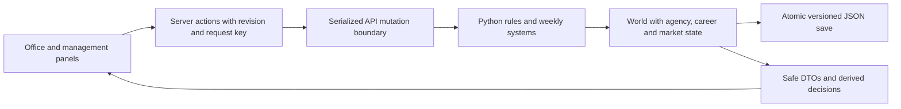

# Agency tycoon expansion

**Status:** experimental · **Added:** 2026-09-10

## What it does

The web game now opens in an illustrated agency office. Its desks, staff occupancy, premises level and trophy shelf reflect game state. Agency, careers and market workspaces connect business investment with client outcomes. The Python engine remains the authority; the CLI exposes the same new actions.

## Gameplay

- **Agency:** one support slot per HQ level; client managers have named client portfolios, liaisons have named club portfolios. Assignments persist across weeks. Department investments improve scouting, client support and networking, with recurring costs and no refund when reduced. Negative trust mitigation is capped at 35%.
- **Identity:** emblem and accent at setup or in Agency. Youth, career and deal specializations unlock after earning commission; later changes happen at season boundaries.
- **Objectives:** choose growth, stability or career deals at the start of a season. Reputation rewards happen once. Reviews and milestone dates persist.
- **Careers:** trait/circumstance goals, tracked move commitments, six conversation families, explicit consequences and cooldowns. Goals, moves and relationship explanations have timelines; departed clients remain in alumni.
- **Market:** named club relationships, compatible pitches limited per client/club/window, published recruitment needs, rival portfolios and warning time before poaching. Comparisons use report ranges and published terms, with staying put as a baseline. Commission values are estimates at the published ceiling, not offers.
- **Loans:** parent approval, compatible host, half-season/season-end terms, up to three proposals, bounded contribution and fees. Parent ownership and host playing time remain separate. Return/expiry/retirement release wage commitments correctly. Loan commission is awarded once; active loans block permanent moves.
- **Pacing:** Continue advances one week. Advance to next event uses at most 12 ordinary ticks, stopping for decisions, warnings, major events and window boundaries. Cancel prevents the next request; the currently running week completes.

No full squad simulation, furniture-placement system, multiplayer or external AI runtime is introduced. Original uncertainty, negotiation limits and greed consequences remain.

## Data flow

New modules split agency, careers and market rules from their plain persisted dataclasses. Their routers expose `GET /api/management`, `/api/careers`, `/api/market`, and corresponding `POST /action` operations with `{operation, payload}`. UI reads are validated with Zod; hidden player abilities and negotiation thresholds are not public DTO fields.

Weekly integration initializes expansion state, advances the date, processes market expiry/returns before ordinary contracts and development, runs existing systems, records career events, then evaluates career/agency progress. Loan retirement restores parent ownership before ordinary retirement releases its wage. Support costs feed the existing solvency and forced-downsizing system.

The finance ledger records transfer and loan commissions in their action week, separates support upkeep from one-off investments, and settles operating costs once. Re-running settlement preserves existing action entries without crediting income or charging expenditure twice.

## Persistence and concurrency

Save schema v2 accepts v1 through dataclass defaults. Existing clients, scouts, contracts and finances survive. Expansion records start neutral; a legacy move promise receives a fresh deadline. New games invalidate previous sessions using their save slot; loading the same active slot shares its authoritative session.

Successful API mutations persist before success reaches the browser. A local process lock serializes reads/writes. `If-Match` rejects stale rendered revisions; `Idempotency-Key` records up to 64 successful retry receipts. Repeated keys with different bodies are rejected. Save failures roll back world state and clear live negotiation handles.

Normal transfer/signing negotiation handles remain session-only and expire on a week boundary or after 15 minutes. Loan talks persist as data. An old receipt cannot revive a dead session negotiation. Standard talks can be resumed while still live; lapsed talks close with an explanation.

## Screens and accessibility

- `/`: office, objective, contextual next step, clients and recent events.
- `/overview`: detailed financial/client/scouting pressure overview.
- `/agency`, `/season-review`: staff, departments, identity, objectives and past outcomes.
- `/careers`, `/clients/[id]`: conversations, contracts and career dossiers.
- `/scouting`, `/prospects/[id]`: filters, persistent shortlist, uncertainty and approaches.
- `/market`, `/clubs/[id]`, `/world`: opportunities, relationships, safe comparisons and rivals.
- Existing `/headquarters`, `/finances`, `/leagues` remain reachable.

Phone navigation has Office, Clients, Market and More; a global decisions drawer stays beside Continue. Desktop retains an always-visible week rail. Negotiations use a side panel on desktop and full screen on phones. Text labels accompany colours, forms show errors, and motion respects reduced-motion preferences.

## Configuration

- `football_agent/data/agency_expansion.json`: staff, departments, specialization and objectives.
- `football_agent/data/career_expansion.json`: goal deadlines, trust consequences and conversation cooldowns.
- `football_agent/data/market_balance.json`: pitches, relationship changes and loans.
- Existing `balance.json` still controls core scouting, finance, transfers and reputation.

## Verification and balance observations

Final automated verification: 134 Python tests passed (2 skipped), 25 UI unit tests passed, and all 3 production-stack browser tests passed. The browser run includes a successful production build.

Engine tests cover capacity, portfolios, quote/cash agreement, promises, read-only projections, save migration, retry receipts, stale revisions, rollback, loan return/retirement, and API/engine rule parity. Browser tests create an agency, sign a player, resolve a conversation and observe the decision disappear, hire and reload staff, navigate new routes, and use phone controls without horizontal overflow.

A 100-seed, five-season comparison ran four scripted policies (400 runs). Initial bankruptcy rates were 15% balanced, 44% growth expansion, 24% client expansion and 37% deal expansion. Median commissions were £435.9k, £250.5k, £1.02m and £389.4k respectively. These compound strategies use distinct policy RNG streams; they do not establish causal effects or optimal play. Staff and department spending needs deliberate cash management, and more human playtesting is required before treating these as final balance numbers.

The proposed five-person usability/fun study has not been performed. Automated tests establish working mechanics and flows, not that every strategy is equally enjoyable.

## Finance and progression review (2026-09-18)

The finance screen exposes the current weekly retainers, scout wages, regional
costs, premises and support overheads before the first week runs. Its budget
and the weekly settlement share `systems.finance.weekly_budget`; commissions
and investments remain separate ledger entries. The next-window forecast is
current cash plus current weekly net times weeks to the next opening. It holds
commitments constant and excludes future deals, departures, purchases, share sales and
forced cuts. The screen distinguishes an open window (including its final
week) from the next opening, and warns about negative cash even when recurring
income covers costs.

Office, Agency and the agency record share the same seasonal objective display:
plain-language action, progress, configured reputation reward and a link to the
relevant screen. `/api/management` returns objective rewards and all configured
objective options. Completion still settles on the weekly tick, once per season;
this pass does not change rewards or save formats. The milestone wall shows all
four existing milestones before they are earned, with their requirements and
first-deal specialization unlock. Desktop navigation links directly to the record.

Scouting, Market, Finances, Clients, Careers, Premises, Stocks and the new-game
screen use five generated editorial illustrations in `web/public/images/`. See that directory's README for provenance
and exact prompts. The existing office illustration continues to show actual
headquarters level, staff and earned milestones.

The [stock exchange](investments.md) adds optional investing with agency cash;
its sale proceeds remain separate from football commission.
