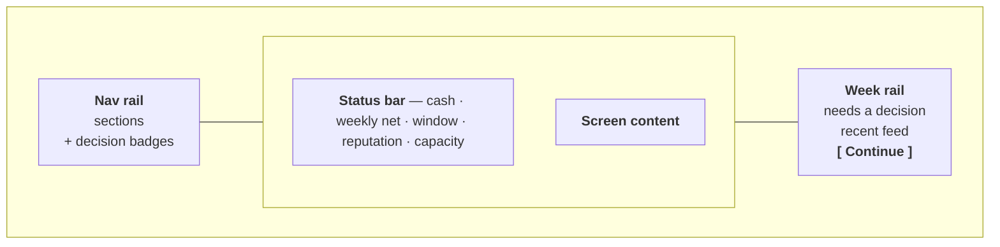

# The app shell

Defined in `web/app/(game)/layout.tsx`. Three zones, present on every screen in
the game.

## Why rails

The previous shell was a cramped two-row header, a 1152px centred column, and a
Continue button floating over roughly 700px of empty black on a 1440px screen.
That emptiness was the single biggest reason it read as unfinished.

The rails fix four things at once:

1. **The dead space disappears.** The viewport is used.
2. **Continue gets a home.** It is anchored at the foot of the week rail rather
   than floating over nothing.
3. **You cannot press past a waiting club.** Continue is irreversible — one
   press is one week and there is no undo. With the open decisions permanently
   beside it, pressing it while a club waits on an answer is a choice rather
   than an accident.
4. **It reads as a console** rather than a document, which is the stated voice.

The cost is that the old Inbox screen became redundant, so `/` was repurposed as
an agency dashboard.

## The zones

### Nav rail (`components/shell/nav-rail.tsx`)

Six sections, each with the CLI's number-key shortcut preserved and shown.
Vertical rather than a horizontal strip because it has to carry per-section
decision counts, and a strip has nowhere to put those without becoming noise.

The keyboard hint is drawn as a bordered key cap. An unstyled digit sitting
where a badge goes reads as "5 things need you", which is exactly the confusion
the badges exist to avoid.

`NavStrip` is the same navigation as a horizontal scroller for viewports too
narrow for the rail. Both are landmarks with distinct labels (`Main` and
`Sections`) so assistive tech and tests can tell them apart.

### Status bar (`components/shell/status-bar.tsx`)

Everything you should never have to go looking for: cash beside weekly net (the
game's central pressure), the window state and its countdown, reputation, and
your client and scout capacity against their caps.

### Week rail (`components/shell/week-rail.tsx`)

Open decisions at the top, the chronological feed below, Continue anchored at
the foot with a count of what is still open. See
[decisions-model.md](../decisions-model.md) for how that list is built.

## The Continue button

`components/continue-button.tsx` renders in two positions depending on the
viewport — anchored in the rail on wide screens, floating bottom-right when the
rail is hidden. Both instances exist in the DOM and only one is visible.

Because of that it listens for a `fa:continue` window event rather than exposing
an `id` for the keyboard handler to click; the handler that responds checks its
own visibility first. An id-based handler would fire the hidden one.

## Responsive behaviour

Desktop-first, degrading rather than reimagining.

| Width | Nav | Week rail | Continue | Tables |
| --- | --- | --- | --- | --- |
| ≥ 1280px | Rail with labels | Visible | In the rail | Full tables |
| 768–1279px | Icon-only rail | Hidden; decisions move into the dashboard | Floating | Full tables |
| < 768px | Horizontal strip | Hidden | Floating | Clients collapses to stacked cards |

The decisions panel on the dashboard is `xl:hidden` — it is a duplicate of the
rail on wide screens, and the *only* place decisions appear on narrow ones.

## Keyboard

| Key | Action |
| --- | --- |
| `C` | Continue — one week |
| `1`–`6` | Jump to a section |
| `Esc` | Close a dialog |

Ignored while typing in a field or while a dialog is open; dialogs own their own
keys.
