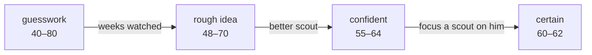

# The design system

Everything visual lives in two files: `web/app/globals.css` (tokens) and
`web/components/ui.tsx` (primitives). If a screen is reaching for a raw class
string to build a panel, a table header or a badge, that is a bug — the point of
the primitives is that density, spacing and colour stay identical everywhere
without anyone having to remember the strings.

## The voice

The game is dry, terse and a little cold, and the interface is a console you
read rather than a page you browse. Three rules hold it together.

**1. Numbers are the content.** Every figure you might compare against another
figure is set in `.num` — Geist Mono with tabular figures. A wage lines up under
a ceiling, an ability range under another ability range, and scanning a column
costs nothing. In a proportional face those never align and every comparison
becomes work.

**2. Colour carries meaning, never decoration.** The five severity colours map
one-to-one onto the engine's `Severity` enum, so colour is information rather
than styling. The accent means exactly one thing — *this is actionable* — and is
spent sparingly, because an accent used for six different purposes stops
signalling anything.

**3. Surfaces form an elevation ramp.** Depth tells you what contains what, so
borders can stay quiet.

## Colour

| Token | Value | Role |
| --- | --- | --- |
| `ink` | `#08090d` | Application floor |
| `panel` | `#0f1117` | Cards, panels, the nav rail |
| `panel-2` | `#151823` | Table headers, hovered rows, inputs |
| `panel-3` | `#1c2030` | Active nav item, focused input |
| `line` | `#262b3a` | Quiet borders and dividers |
| `line-strong` | `#384054` | Emphasised rules, chart baselines |
| `fg` | `#eef1f6` | Primary text |
| `dim` | `#a3abbd` | Secondary text — 8.6:1 on ink |
| `faint` | `#7c8599` | Captions, column headers — 5.4:1 on ink |
| `accent` | `#6e7bff` | "This needs a decision" — 5.6:1 on ink |
| `good` / `warn` / `bad` | `#4ade80` / `#f0b44a` / `#f05d5d` | Engine severities |

Two deliberate changes from the original palette:

**Contrast.** The previous caption grey sat at roughly 3.2:1 against the
background — below the 4.5:1 floor for body text — and it was used for helper
text, column headers and most labelling, so a meaningful share of the interface
was genuinely hard to read. Every text token now passes AA.

**The accent moved from cyan to indigo.** The constraint is that the accent must
stay visually distinct from all four severity hues, or it reads as a state
rather than an invitation to act. That rules out most warm choices. Cyan
satisfied the constraint but vibrates at full saturation on near-black, which
was a large part of why the screens felt cheap. Indigo sits clear of green,
amber and red, and reads as cold rather than neon.

## Type

Two self-hosted faces via the `geist` package, so there is no runtime network
dependency and no fallback flash. Geist Sans carries prose; Geist Mono carries
every number.

| Class | Role |
| --- | --- |
| `.t-title` | Screen title. One per route. |
| `.t-section` | Section heading inside a screen. |
| `.t-label` | 11px uppercase eyebrow — column headers, panel labels, stat captions. |
| `.t-note` | Supporting prose: hints, reasons, consequences. |
| `.num` | Any figure you compare. Mono, tabular, slightly tightened. |

Four roles, deliberately few. The previous interface set everything at 14px in
one weight, which is why it read as a spreadsheet dump: there was no visual
difference between a heading, a column header, a value and a caption, so the eye
had nothing to grab.

## Primitives

From `web/components/ui.tsx`:

- **`Panel`** — the base surface. `tone` marks a panel that is asking something
  of the player (`action`, `warn`, `bad`).
- **`PanelSection`** — a panel with a titled header strip and optional actions.
- **`ScreenHeader`** — the screen-level title and its one-line framing.
- **`StatTile`** — a headline figure. The label is always quiet so a row of them
  scans as numbers first.
- **`Badge`** — a small label. Colour always travels with a word.
- **`Table` / `Th` / `Td`** — real `<table>` markup, because this is tabular
  data and screen readers should be told so. The wrappers exist only to keep row
  height, alignment and header treatment identical everywhere.
- **`EmptyState`** — always says what is missing *and* what to do about it. A
  bare "nothing here" leaves a new player stuck on a black screen with no next
  move.
- **`Skeleton`**, **`inputClass`**, **`buttonClass`**.

## Signature components

### RangeBar

The most important component in the game. Ability is never a number: "61–74,
confident" is drawn as a band on a track, because the uncertainty *is* the
mechanic. The width is your ignorance.

Confidence drives the colour, and the colour is always accompanied by the
confidence word, so a player who cannot distinguish green from amber still reads
"certain" versus "guesswork". The bar animates between values rather than
snapping — watching a range tighten week by week is the one thing this interface
can do that the terminal could not.

A minimum width keeps a perfectly known value visible; without it, `certain`
renders as nothing at all, which reads as missing data.

### TrustMeter

Trust is a mood, not a number: the engine's label leads and the figure is
secondary. The 40 line is drawn on the track because that is the band where a
client starts refusing what you ask of him. Under 40 the whole thing goes red;
between 40 and 60 it is amber.

### SeasonTimeline

The season as a bar, the transfer windows as bands, now as a marker. The single
most expensive mistake available is drifting past a window — deals can only be
struck inside one, and commission is the only real income — and "next window in
19 weeks" means nothing until you can see how much of the season that is.

## Motion

Used for exactly one thing: making a state change legible. `.anim-rise` for
things arriving, `.anim-slide-in` for a counter-offer landing, and the RangeBar's
width transition. All of it collapses under `prefers-reduced-motion`.

## Accessibility

- Every text colour passes AA on the ink background.
- Colour never travels alone: severities carry a glyph, badges carry a word,
  range bars carry the confidence label.
- `:focus-visible` draws a 2px accent ring on everything.
- Range bars and trust meters expose `role="img"` with a readable
  `aria-label`, so the value survives without sight of the bar.
- Modals trap focus, restore it on close, and close on Escape.
- Tables are real tables with `scope="col"` headers.
